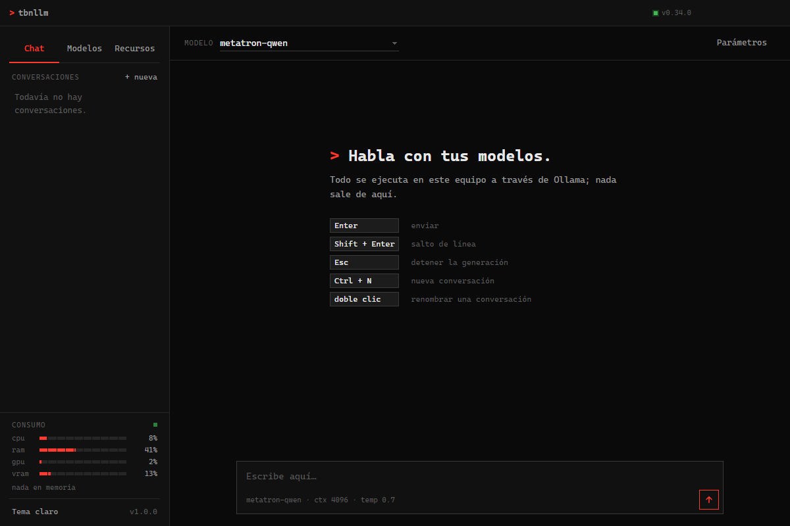
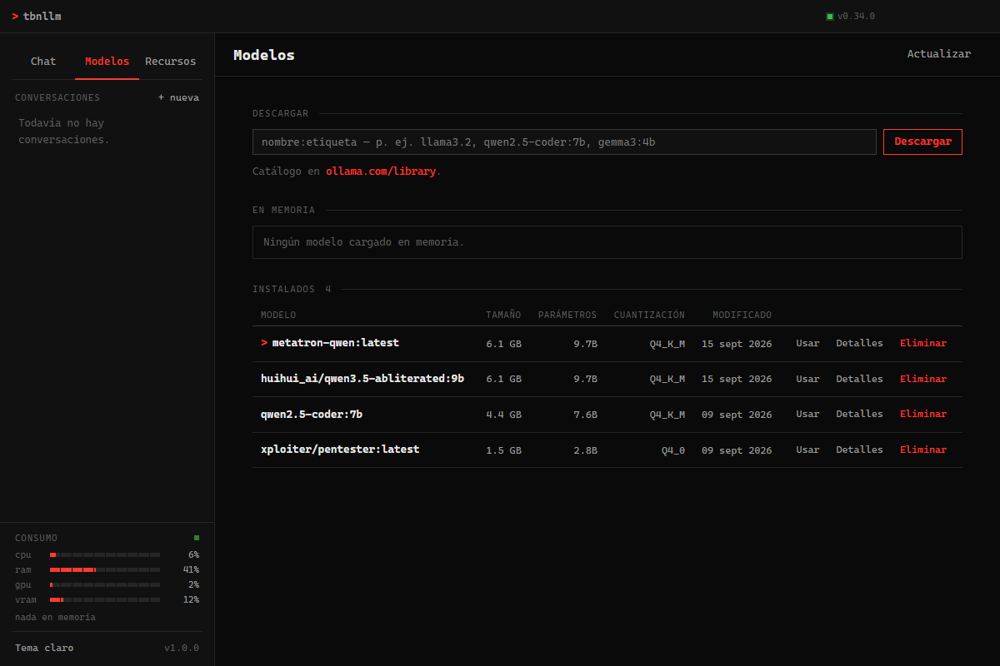
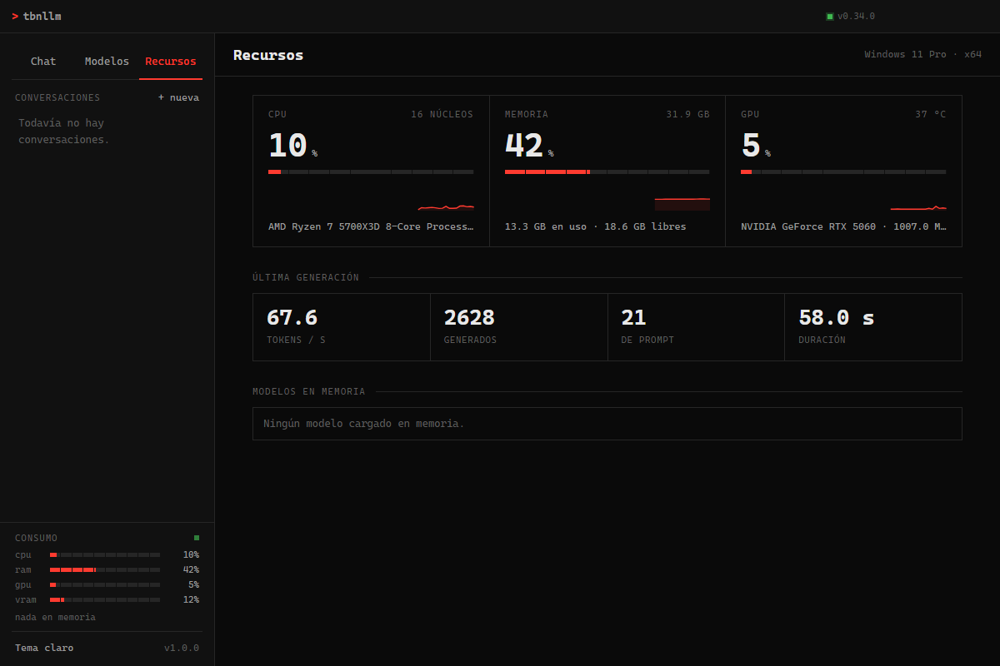
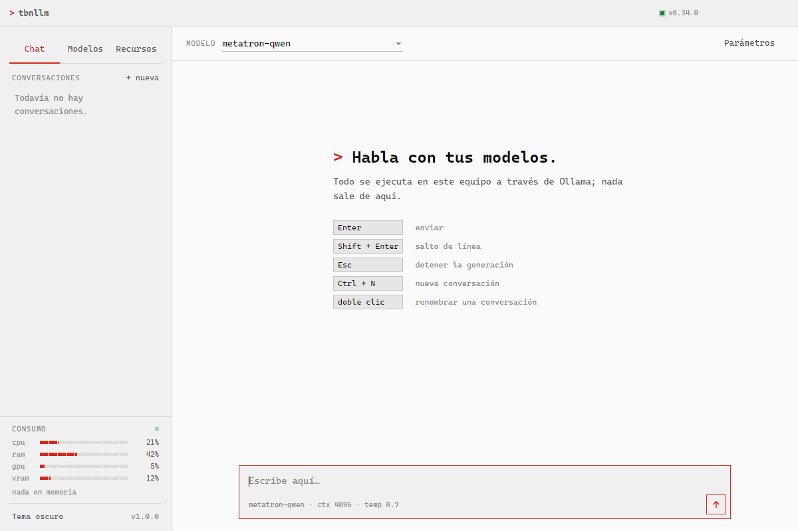

# tbnllm

App de escritorio (Electron, Windows) para **chatear con** y **gestionar** tus modelos locales de
[Ollama](https://ollama.com). Cliente puro: no envía nada a internet, todo pasa por tu `ollama serve` local.



## Funciones
- **Chat con streaming** token a token, Markdown, tablas y bloques de código con botón *copiar*.
- **Conversaciones** guardadas localmente: renombrar (doble clic), borrar, regenerar la última respuesta.
- **Gestor de modelos**: tabla con tamaño, parámetros y cuantización; descargar con progreso, ver detalles
  (arquitectura, contexto máximo, plantilla, licencia), eliminar y elegir el activo.
- **Consumo siempre a la vista** en el lateral (CPU, RAM, GPU y VRAM con `nvidia-smi`) y una vista
  **Recursos** con histórico, estadísticas de la última generación (tok/s, tokens, duración) y modelos en memoria.
- **Parámetros**: system prompt, temperatura y `num_ctx`; resumen visible junto al cuadro de texto.
- **Detecta si falta Ollama**: si no está instalado te ofrece el link de descarga; si está pero apagado, lo
  arranca sola. Tema claro/oscuro; recuerda tamaño de ventana.
- Barra de título propia, a juego con el resto del diseño (nada de marco blanco de Windows).
- Atajos: `Enter` enviar, `Shift+Enter` salto de línea, `Esc` detener, `Ctrl+N` nueva conversación.

<details>
<summary>Más capturas (modelos, recursos, tema claro)</summary>





</details>

## Requisitos
- Windows 10/11 de 64 bits.
- [Node.js](https://nodejs.org).
- [Ollama](https://ollama.com) instalado, con al menos un modelo descargado (`ollama pull llama3.2`) — la
  app te avisa y te da el link si no lo tenés.

## Arrancar

```bash
git clone https://github.com/estxbvnnn/tbnllm.git
cd tbnllm
```

Doble clic en **`tbnllm.bat`** — arranca Ollama si hace falta y corre `npm install` solo la primera vez,
con un loader animado. O a mano:

```bash
npm install
npm start
```

Toda la comunicación con Ollama ocurre en el proceso principal de Electron (`main.js`), así que no hay
problemas de CORS y el streaming es fluido. Los datos (conversaciones, tema, ajustes) se guardan en
`localStorage`, solo en tu equipo.

## Compilar el .exe portable

```bash
npm run dist
```

Genera `dist\win-unpacked\` y `dist\tbnllm-portable\tbnllm.exe`. Para además obtener un instalador de un
solo archivo (`Setup.exe`), electron-builder necesita crear symlinks, lo que en Windows requiere **Modo
Desarrollador activado** o una terminal como administrador; sin eso, la carpeta/ZIP portable funciona
igual de bien.

## Licencia
[MIT](LICENSE)
